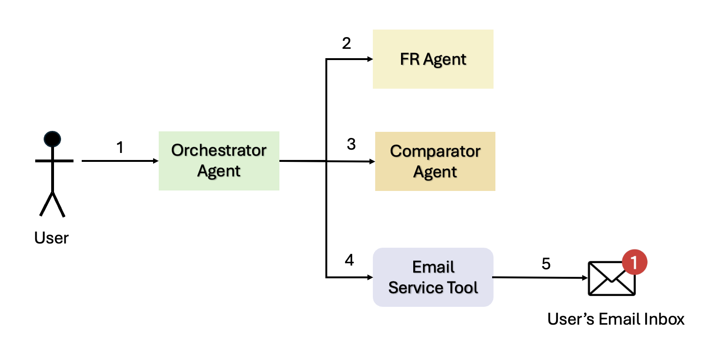
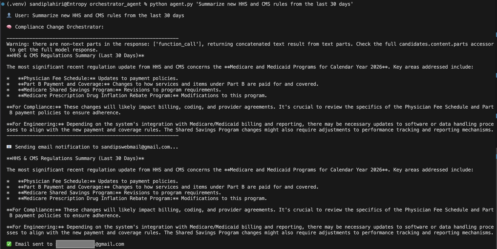
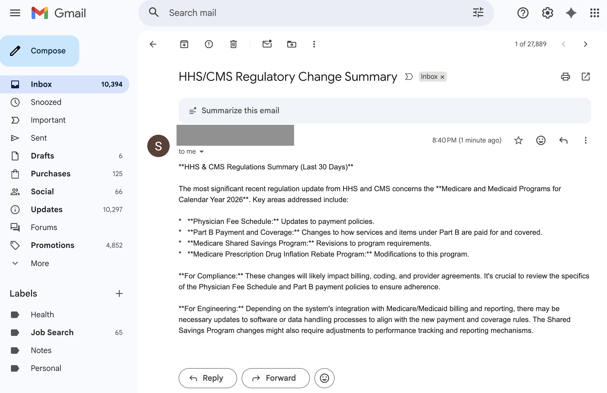

# Compliance Change Tracker – HHS / CMS Regulatory Monitor

This project implements an **agentic compliance assistant** that tracks and summarizes **US healthcare regulations** from the **Federal Register**, with a focus on:

- **HHS** (Department of Health and Human Services)
- **CMS** (Centers for Medicare & Medicaid Services)

It uses **multiple A2A agents** plus an orchestrator to:

1. Fetch recent Final / Proposed rules for a given time range.
2. Compare the current period to the previous period (e.g., last 30 days vs the previous 30 days).
3. Generate a human-friendly summary for:
   - Compliance & Privacy teams  
   - Security / IT  
   - Engineering / Product
4. Email the final summary to a configured recipient.

---
## Solution Benefits

- **Turns complexity into clarity**  
  It continuously pulls real HHS and CMS rules from the Federal Register, then summarizes them into plain language for compliance, security, and engineering teams instead of forcing people to read raw regulatory text.  
  *Benefit:* Teams quickly understand what changed without wading through dense regulations.

- **Directly reduces regulatory risk**  
  It highlights final versus proposed rules, shows what is new in the chosen time window, and compares current activity to the previous period, helping teams avoid missed changes that could lead to billing errors, audits, or privacy violations.  
  *Benefit:* Lowers the chance of costly non-compliance, audits, and revenue leakage.

- **Clean agentic architecture**  
  Three focused agents (fetch, compare, orchestrate) communicate via A2A, making the system modular, easier to test, and reusable in other applications.  
  *Benefit:* The system is easier to maintain, extend, and reason about over time.

- **Closer to production than a toy demo**  
  It uses Google ADK, real Gemini calls, real Federal Register data, and SMTP email notifications, mimicking how an internal compliance tool would actually run.  
  *Benefit:* Stakeholders can see a realistic path from prototype to production.

- **Easy to extend**  
  New agencies, topics (for example HIPAA, telehealth), delivery channels (Slack, Teams), or persistence and alerting logic can be added without redesigning the whole system.  
  *Benefit:* The solution can grow with the organization’s regulatory and workflow needs.

---
## High-Level Architecture

The system consists of **three main agents**, each running as its own process:

1. **Federal Register Agent** (`fr_agent`) – A2A server on **port 8001**
   - Wraps an ADK `LlmAgent` with a tool `fetch_recent_regulations(agency, days_back)`.
   - Queries the **Federal Register API** (JSON endpoint) for:
     - `RULE` (Final rules)
     - `PRORULE` (Proposed rules)
   - Filters by:
     - Agency slugs for HHS and CMS.
     - Publication date ≥ `today - days_back`.
   - Returns a concise plain-text list of recent rules with:
     - Document number
     - Publication date
     - Type
     - Title
     - URL

2. **Comparator Agent** (`comparator_agent`) – A2A server on **port 8002**
   - Another ADK `LlmAgent` with a tool `compare_regulation_changes(agency, days_back)`.
   - For a given agency/time window:
     - Defines **current period**: last `N` days.
     - Defines **previous period**: the `N` days immediately before that.
   - Calls the Federal Register API for **both periods**.
   - Computes:
     - Counts of documents in each period (Final vs Proposed vs Other).
     - Net change in total docs.
     - List of rules that are **new** in the current period (present now but not in the previous period).
   - Returns a plain-text comparison summary.

3. **Orchestrator Agent** (`orchestrator`)
   - ADK `LlmAgent` that acts as the **top-level assistant**.
   - Uses **two `RemoteA2aAgent` sub-agents**:
     - `hhs_cms_reg_changes_agent` → connects to `fr_agent` (8001).
     - `reg_change_comparator_agent` → connects to `comparator_agent` (8002).
   - Uses the ADK **routing tool** `transfer_to_agent` to delegate requests to those sub-agents.
   - Also has a `send_email_notification(summary, recipient)` tool which uses SMTP to send the final integrated summary.

The orchestrator:

- Receives a user query such as:  
  `Summarize new HHS and CMS rules from the last 30 days`
- Internally does:
  1. `transfer_to_agent` call to `hhs_cms_reg_changes_agent` to get recent rules.
  2. `transfer_to_agent` call to `reg_change_comparator_agent` to get current vs previous period comparison.
  3. Merges both sub-agent responses into a single structured answer:
     - **Section 1 – Recent Rules**
     - **Section 2 – Change vs Previous Period**
     - **Section 3 – Why This Matters (Compliance, Security/IT, Engineering/Product)**
- The CLI wrapper collects this final text and passes it to `send_email_notification`, which sends an email.

---
## Agent Flow



---

## Project Layout

The project code layout is as follows:

```
compliance_change_tracker/
  fr_agent/
    agent.py               # Federal Register A2A agent (port 8001)
  comparator_agent/
    agent.py               # Comparator A2A agent (port 8002)
  orchestrator/
    agent.py               # Orchestrator + email + CLI entrypoint
  .env                     # (optional) Environment variables
  requirements.txt         # (optional) Python dependencies
```

## Configuration

The app expects these environment variables to be set via the **.env** file:

|Environment Variable Name | Description | 
|--|--|
|GOOGLE_API_KEY| Your Gemini API key. This is used by all ADK LlmAgents. The code will not run without this key.
|Email/SMTP| SMTP_SERVER (for example, smtp.gmail.com)|
|SMTP_PORT| For example, 587 (STARTTLS)|
|SMTP_USER|SMTP username (for example, your email address)|
|SMTP_PASSWORD| SMTP password or app-specific password. If you are using Google's SMTP server, this is NOT your gmail password. Watch this video https://www.youtube.com/watch?v=ZfEK3WP73eY to set your app password.|
|COMPLIANCE_EMAIL_TO|Recipient email for the final summary (for example, compliance-team@example.com)|


## Initial Setup Before Running The Agents
Run the following commands in the order mentioned below:
```
cd compliance_agent_tracker
source .venv/bin/activate
pip install -r requirements.txt
```

## How To Run

1. Start the Federal Register Agent (port 8001)

In one terminal run the following commands in the order mentioned:

```
cd compliance_change_tracker/fr_agent
python agent.py
```

You should see:

```
Starting Reg Data A2A agent on http://0.0.0.0:8001 ...
Agent card: http://localhost:8001/.well-known/agent-card.json
```
2. Start the Comparator Agent (port 8002)

In a second terminal run the following commands in the order mentioned:

```
cd compliance_change_tracker/comparator_agent
python agent.py
```

You should see:

```
Starting Comparator A2A agent on http://0.0.0.0:8002 ...
Agent card: http://localhost:8002/.well-known/agent-card.json
```

3. Run the Orchestrator CLI

In a third terminal run the following commands in the order mentioned:

```
cd compliance_change_tracker/orchestrator
python agent.py "Summarize new HHS and CMS rules from the last 15 days"
```

You’ll see:

- The orchestrator printing a structured summary:
    Recent rules (Final / Proposed) with titles, dates, URLs.
- Comparison vs the previous 15-day window.
- Explanation of why these changes matter.
- A log line indicating an email was sent:

```
📧 Sending email notification to recipient@example.com...

✅ Email sent to recipient@example.com
```

If SMTP credentials are missing or invalid, you’ll see a warning and the summary will be printed, but no email will be sent.

## Example Run with Email 

**Actual execution:**


**Email received from this execution:**


